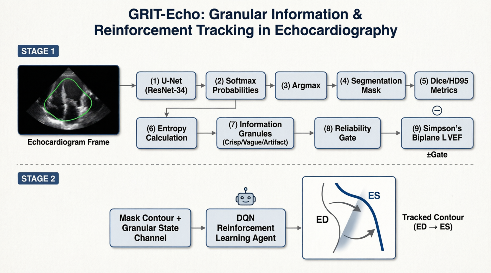

<div align="center">

# GRIT-Echo

**GR**anular **I**nformation & **R**einforcement **T**racking in **Echo**cardiography

[](https://www.python.org/)
[](https://pytorch.org/)
[](LICENSE)

*Granular-computing-based reliability gating for left-ventricle segmentation and LVEF estimation, coupled with a reinforcement-learning contour-tracking formulation on the CAMUS dataset.*

</div>

---

## 📋 Table of Contents

- [Overview](#overview)
- [Research Questions](#research-questions)
- [Project Architecture](#project-architecture)
- [Results](#results)
- [Repository Structure](#repository-structure)
- [Environment & Reproduction](#environment--reproduction)
- [Dataset & Mandatory Citation](#dataset--mandatory-citation)
- [Citing This Work](#citing-this-work)
- [License](#license)

---

## Overview

Automated left-ventricle (LV) segmentation in 2D echocardiography achieves high average accuracy, but per-case reliability remains unquantified. Standard networks emit point predictions even where acoustic shadowing and speckle noise leave the boundary undefined. **GRIT-Echo** addresses this across two integrated stages:

1. **Supervised Baseline & Granular Uncertainty:** A U-Net with a ResNet-34 encoder, trained on the official CAMUS splits and validated against the clinical endpoint (LVEF by Simpson's biplane method, per ASE recommendations). Per-pixel predictive entropy is converted into information granules (crisp, vague, artifact-prone) with cutpoints frozen on the validation split. Granule composition predicts per-case segmentation error and supports a deterministic reliability gating rule.
2. **Sequential Tracking MDP:** A Gymnasium environment (`ContourTrackerEnv`) that formulates LV contour tracking from end-diastole to end-systole as a Markov decision process. The state carries the image frame, a 32-landmark radial contour, temporal progress and the local boundary granule. The reward is a granule-weighted soft Dice against the frozen posterior, with action and smoothness penalties and a terminal hard-Dice bonus against the expert ES mask.

## Research Questions

- **RQ1:** Does predictive entropy concentrate predictably at anatomical boundaries and artifact regions, particularly within expert-rated poor-quality subgroups?
- **RQ2:** Do granule-level statistics reliably predict per-case segmentation and LVEF error, enabling unreliable cases to be flagged automatically before clinical deployment?

---

## Project Architecture



---

## Results

All numbers come from the final committed run. Segmentation, entropy and gating statistics are reported on the official test split (50 patients, 200 frames); the tracking comparison uses the validation split with 20 paired seeds.

| Experiment | Metric | Result |
| :--- | :--- | :--- |
| Validation foreground Dice | best checkpoint | 0.9175 (epoch 19 of 20) |
| Segmentation (test) | Dice, cavity / myocardium / LA | 0.935 / 0.877 / 0.915 |
| Segmentation (test) | HD95 mm, cavity / myocardium / LA | 3.99 / 4.20 / 4.18 |
| Simpson estimator check (val, expert masks) | biplane MAE, bias, r | 7.67 EF points, +7.67, 0.97 |
| LVEF endpoint (test) | vs EF recomputed from expert masks | MAE 4.37 EF points, bias -1.22, r 0.867 |
| LVEF endpoint (test) | vs sonographer reference | MAE 7.90 EF points, bias +6.34, r 0.842 |
| RQ1, tissue entropy vs image quality | Kruskal-Wallis H, p, epsilon-squared | 23.93, 6.4e-06, 0.242 |
| RQ2, artifact fraction vs per-case Dice | Spearman rho, p | -0.535, 9.5e-09 |
| RQ2, artifact fraction vs per-case HD95 | Spearman rho, p | +0.428, 9.1e-06 |
| RQ2 gating rule (artifact fraction > 0.5) | retained vs flagged Dice, p | 0.918 vs 0.892, 2.7e-06 |
| RQ2 selective refusal (worst 30% refused) | retained HD95, full vs refused | 4.12 mm vs 3.82 mm |
| Tracking MDP (val, paired) | PPO vs passive terminal ES Dice | 0.609 vs 0.610, delta -0.001, p 0.062, win rate 0.35 |

**Note on the tracking MDP.** PPO trains stably under the granule-gated reward (approximate KL about 0.015, clip fraction about 0.2, no entropy collapse), but its terminal ES Dice is statistically indistinguishable from a passive policy that carries the ED contour to ES. Flattened 64 x 64 observations deprive the MLP policy of topological features, and the terminal bonus is sparse over roughly 18 steps. The contribution of this stage is therefore the formulation itself: the state space, the granule-gated reward and the paired baseline harness that future tracking agents (CNN feature extractors, behavior cloning from the posterior) can be measured against.

---

## Repository Structure

```text
grit-echo/
├── notebooks/
│   └── grit-echo.ipynb        # Full pipeline with committed outputs
├── figures/                   # Architecture diagram and audit overlays
├── audit.py                   # Stage 0: dataset integrity audit
├── make_pack.py               # Builds the license-compliant Kaggle upload pack
├── make_seq_pack.py           # Builds the half-sequence companion pack
├── reports/                   # Project summaries and slides
├── requirements.txt           # Dependency lower bounds
├── README.md
└── .gitignore
```

---

## Environment & Reproduction

| Component | Specification |
| :--- | :--- |
| Python | 3.10+ (published runs use 3.12) |
| Frameworks | PyTorch 2.x, Gymnasium, Stable-Baselines3 |
| Medical IO and vision | nibabel, opencv-python, albumentations 2.x |
| Hardware | NVIDIA T4 (Kaggle) or equivalent CUDA GPU |

### Reproduction Steps

1. **Data acquisition:** request the official CAMUS dataset from the [Human Heart Project](https://humanheart-project.creatis.insa-lyon.fr/database/). This repository does not redistribute raw data.
2. **Local environment:** install PyTorch for your CUDA driver, then `pip install -r requirements.txt` and run `python audit.py` to verify pack integrity.
3. **Dataset packing:** run `python make_pack.py` for the ED/ES pack and `python make_seq_pack.py` for the half-sequence volumes, then upload both as private Kaggle datasets.
4. **Execution:** open the notebook on Kaggle with both datasets attached, GPU and internet enabled, and Run All. The `RETRAIN` and `TRAIN_RL` flags are auto-safe: they train only when the canonical checkpoint or RL checkpoint is absent, so repeated runs reuse the published artifacts instead of silently producing new ones. A full run from scratch takes about one hour on a T4.

---

## Dataset & Mandatory Citation

S. Leclerc, E. Smistad, J. Pedrosa, A. Ostvik, et al., "Deep Learning for Segmentation using an Open Large-Scale Dataset in 2D Echocardiography," *IEEE Transactions on Medical Imaging*, 38(9):2198-2210, 2019. DOI: [10.1109/TMI.2019.2900516](https://doi.org/10.1109/TMI.2019.2900516).

*We thank CREATIS and the Human Heart Project for open data access.*

---

## Citing This Work

```bibtex
@misc{grit_echo_2026,
  title        = {GRIT-Echo: Granular Information \& Reinforcement Tracking for Echocardiography},
  author       = {Fahim, Iftekhar Alam},
  year         = {2026},
  howpublished = {\url{https://github.com/iftekharalamfahim/grit-echo}}
}
```

---

## License

Code is licensed under the [MIT License](LICENSE). The CAMUS dataset remains subject to its original license terms.